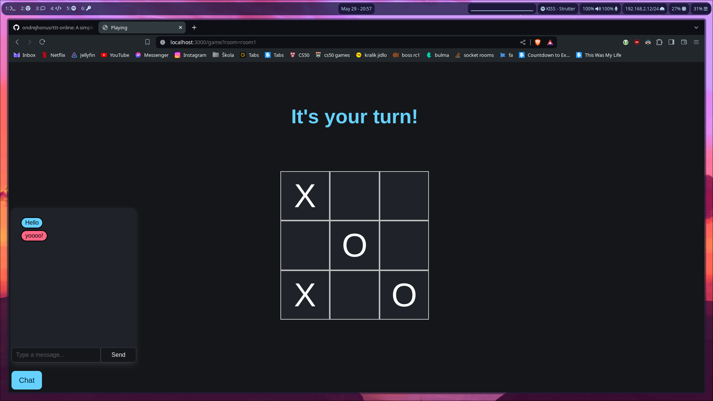
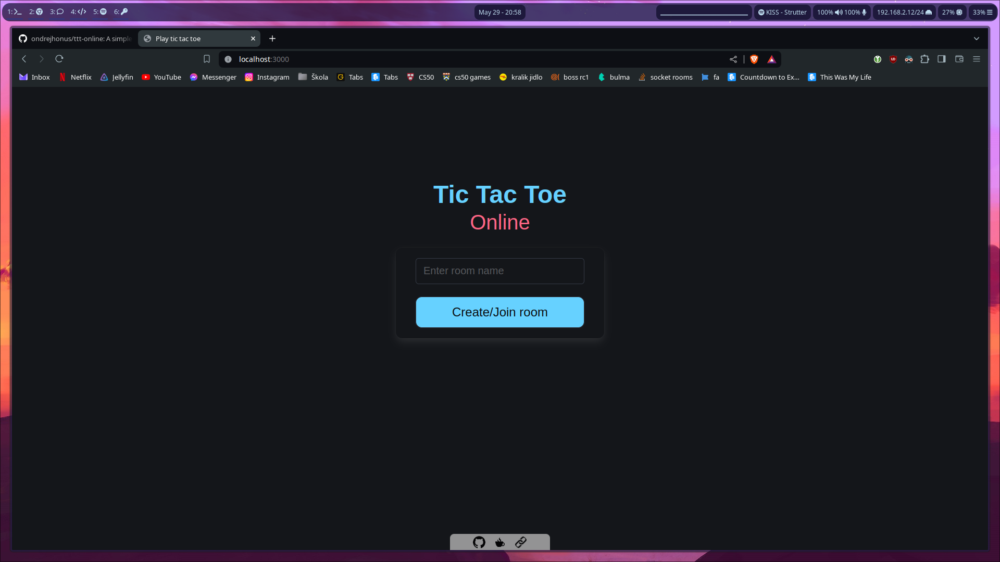

# Tic Tac Toe online
A web game that is you can play with your friend and chat with him at the same time.

# Table of contents  
1. [Introduction](#introduction)  
2. [Screenshots](#screenshots)  
3. [Technologies](#tech-stack)
4. [Features](#features)  
5. [How to run](#run-locally)

## Screenshots  

## Tech Stack  

**Client:** Bulma.io, Fontawesome

**Server:** Nodejs, Express, Socket.io

## Features  

- Real-time chat
- Custom room names
- Rooms just for two

## Run Locally  

Clone the project  

~~~bash  
  git clone https://link-to-project
~~~

Go to the project directory  

~~~bash  
  cd my-project
~~~

Install dependencies  

~~~bash  
npm install
~~~

Start the server  

~~~bash  
node server.js
~~~